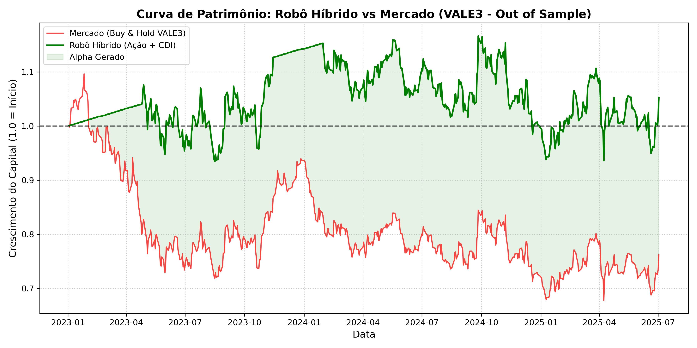

# 📈 Alpha Seeker: IA Quantitativa para Position Trading B3


## 🎯 O Elevador Pitch (Resumo Executivo)
**Alpha Seeker** é um pipeline de ponta a ponta de *Machine Learning* e Engenharia de Dados focado no mercado financeiro brasileiro. O algoritmo prevê tendências direcionais de ações da B3 (horizonte de 6 meses) e gerencia o risco do portfólio de forma autônoma, alocando o capital em Renda Fixa (CDI) quando detecta assimetria de risco negativa. 


*(Gráfico gerado em Backtest Out-of-Sample: O descolamento do modelo Híbrido protegendo o capital durante as quedas do ativo base).*

---

## 💼 O Problema de Negócio
No mercado financeiro, estratégias passivas como o *Buy & Hold* sofrem severamente em ciclos econômicos de alta taxa de juros e mercados em queda. O investidor não apenas perde capital na desvalorização da ação, mas também sofre o **Custo de Oportunidade** de não estar rendendo a taxa básica de juros (Selic). 

O objetivo desta arquitetura de dados é responder a uma pergunta de negócios clara: *"A probabilidade de alta desta ação nos próximos 6 meses justifica o risco, ou o dinheiro estaria mais seguro rendendo o CDI diário?"*

---

## 🛠️ Arquitetura e Stack Tecnológico
O projeto foi estruturado utilizando as melhores práticas de Engenharia de Dados e MLOps:

1. **Extração e Micro-ETL Ao Vivo:** Consumo de APIs do *Yahoo Finance* (`yfinance`) para cotações globais e do *Banco Central do Brasil* (`python-bcb`) para a taxa Selic diária, lidando com fusos horários, feriados e valores nulos em tempo real.
2. **Feature Engineering Quantitativa:** Criação de rastreadores de tendência (Distância de Médias Móveis de 20, 50 e 200 dias), Momento (RSI, Volatilidade) e Contexto Macroeconômico (Força Relativa contra o Ibovespa e Variação do Dólar).
3. **Modelagem de Machine Learning:** Treinamento de modelos baseados em árvores de decisão (`RandomForestClassifier`), priorizando a métrica ROC-AUC para avaliar a capacidade direcional.
4. **Rastreabilidade (MLOps):** Uso do **MLflow** para versionamento de experimentos, salvamento de gráficos estáticos de *Equity Curve* e registro de métricas financeiras.
5. **Deploy em Produção:** Interface Web desenvolvida em **Streamlit**, permitindo a inferência do modelo com dados raspados no exato momento da consulta do usuário.

---

## 🧠 Diferenciais Técnicos da Engenharia (Showcase)

* **Prevenção de *Data Leakage* (Vazamento de Dados):**
  * **Temporal (Embargo):** Implementação de um gap de 126 dias úteis no particionamento do dataset para garantir que o modelo jamais "visse" o futuro durante a fase de treino.
  * **Thresholding Blindado:** O limiar de decisão (*percentil*) foi calibrado estritamente nas probabilidades do conjunto de treino e projetado no teste, evitando contaminação da validação.
* **Score de Janelas vs. Marcação a Mercado:** Para evitar a ilusão matemática de retornos em janelas sobrepostas (*Overlapping Windows*), o backtest financeiro final foi construído utilizando **Execução Diária e Marcação a Mercado**, simulando o saldo real de uma conta corretora, incluindo o atraso de execução (*shift* de 1 dia) e rendimentos diários fracionados do CDI.

---

## 🏆 Resultados Financeiros (Estudo de Caso: VALE3)

O modelo foi submetido a um teste de fogo na base *Out-of-Sample* (Dados invisíveis de 2023 a 2026) operando ações da Vale (VALE3.SA), um período marcado por forte desvalorização estrutural do ativo.

O algoritmo assumiu o controle do portfólio. O placar da rentabilidade real (Marcação a Mercado Diária) foi:

* 📉 Retorno do Mercado (*Buy & Hold* Cego): **-23.79%**
* 🚀 Retorno do Robô Híbrido (Ação + CDI): **+5.22%**
* 📊 **Alpha Gerado (Excesso de Retorno): +29.01%**

**O Veredito:** O modelo entregou um *Alpha* estrondoso contra o mercado. Ele identificou o cenário de alto risco, esquivou-se das principais quedas protegendo o capital na Renda Fixa e garantiu que a carteira terminasse no positivo em um mercado que destruiu quase um quarto do patrimônio dos investidores passivos.

---

## 🚀 Como Executar o Projeto Localmente

1. **Clone o repositório:**
```bash
git clone [https://github.com/rfnove/Alpha_Seeker_Quant_Model.git](https://github.com/rfnove/Alpha_Seeker_Quant_Model.git)
cd Alpha_Seeker_Quant_Model